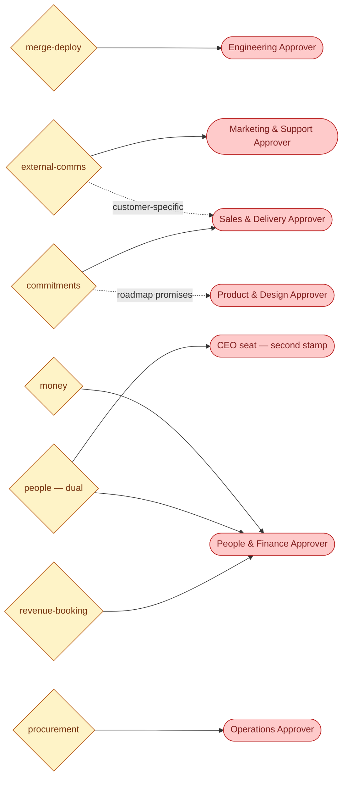
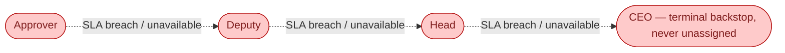

# Agent visualization: gates · 2026-07-15

Generated with `/visualize-agents`, grounded in `company/org/routing.md` §1 (gate → department), `company/org/departments.md`, and CLAUDE.md §5. This map shows **where autonomy stops**: every gate, its owning department's human Approver seat, and the single escalation chain behind all of them.

## Diagram

Escalation behind every Approver seat (identical for all departments):

## Which agents hit which gate

Grounded in the agent charters' "Human-in-the-loop gates" sections:

| Gate | Primary requesting agents |
|---|---|
| `merge-deploy` | `developer`, `devops`, `eng-manager` (verdict input: `code-reviewer`, `tester`, `security`) |
| `external-comms` | `marketing`, `social-media`, `support`, `tech-writer` (publishing); customer-specific: `sdr`, `sales`, `account-manager`, `delivery-manager` |
| `money` | `finance`, `marketing` (spend), `procurement` (spend approval) |
| `commitments` | `sales`, `delivery-manager`, `account-manager`; roadmap: `product-manager` |
| `people` (dual) | `hr` (+ CEO human stamp always required) |
| `procurement` | `procurement` |
| `revenue-booking` | `delivery-manager` (prep), decided by People & Finance Approver |

## Legend

Diamond = gate (`routing.md` gate id) · red stadium = human seat (seat, not person) · dotted = special routing rule or escalation hop. Escalation only **reassigns** — no auto-approve, no expiry (ADR-0004); silence never equals consent.

## Notes

- SLAs (routing.md §2): P0 first response 2h / escalate hourly · P1 1 business day · P2 3 business days.
- Requests are written as `company/approvals/APR-*.md` (questions `QST-*`) once the Phase-1 loop is live; decided via `/approve`.
- Coverage check: all 7 CLAUDE.md §5 gate rows have an owning department and at least one requesting agent — no orphan gates found.
