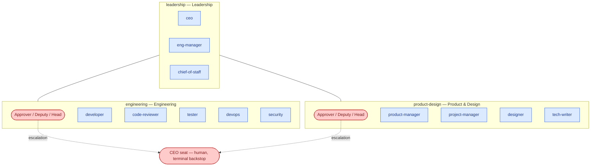

# Agent visualization: org chart · 2026-07-15

Generated with `/visualize-agents`, grounded in `company/org/departments.md`, `company/org/routing.md`, and `.claude/agents/`. Regenerate after any roster or seat change — humans route work by this map.

## Diagram

Split into two diagrams to stay readable: delivery-side departments, then business-side departments. Every department has three human seats (Approver / Deputy / Head); the CEO human seat is the terminal backstop of every chain. Current seat-holders: all seats held by Saran (Founder-Operator) — the n=1 starting state.

```mermaid
flowchart TD
  classDef ai fill:#dbeafe,stroke:#1d4ed8,color:#1e3a8a
  classDef human fill:#fecaca,stroke:#b91c1c,color:#7f1d1d

  ceoSeat2([CEO seat — human, terminal backstop]):::human

  subgraph salesdelivery [sales-delivery — Sales & Delivery]
    sdH([Approver / Deputy / Head]):::human
    sdr[sdr]:::ai
    sales[sales]:::ai
    sa[solutions-architect]:::ai
    dm[delivery-manager]:::ai
    am[account-manager]:::ai
  end

  subgraph marketingsupport [marketing-support — Marketing & Support]
    msH([Approver / Deputy / Head]):::human
    mkt[marketing]:::ai
    social[social-media]:::ai
    support[support]:::ai
  end

  subgraph peoplefinance [people-finance — People & Finance]
    pfH([Approver / Deputy / Head]):::human
    hr[hr]:::ai
    fin[finance]:::ai
  end

  subgraph operations [operations — Operations]
    opH([Approver / Deputy / Head]):::human
    proc[procurement]:::ai
    da[data-analyst]:::ai
  end

  sdH -. escalation .-> ceoSeat2
  msH -. escalation .-> ceoSeat2
  pfH -. escalation .-> ceoSeat2
  opH -. escalation .-> ceoSeat2
```

## Legend

| Convention | Meaning |
|---|---|
| Blue rectangle (`:::ai`) | AI employee (agent id = invocation handle in `.claude/agents/`) |
| Red stadium (`:::human`) | Human seat(s) — Approver / Deputy / Head per department, CEO backstop |
| Dotted edge | Escalation path (`approver → deputy → head → ceo`; reassigns, never approves — ADR-0004) |
| Subgraph | Department per `company/org/departments.md` |

## Notes

- **24 AI employees** across 7 departments (`departments.md` lists 24 across its rows; README.md says "23 digital employees" — **drift**, see below).
- The `eng-manager` sits in `leadership` per `departments.md`, though it coordinates the `engineering` pod and preps its `merge-deploy` gate.
- Drift found: `README.md` says 23 employees while CLAUDE.md §1 says 24 and `departments.md` rows sum to 24 (`.claude/agents/` contains 24 files). `guides/getting-started.md` still says "16 role skills" (actual: 27+).
