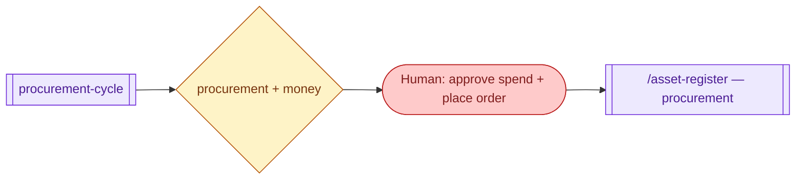

# Agent visualization: value chain · 2026-07-15

Generated with `/visualize-agents`, grounded in CLAUDE.md §4, the lifecycle workflows in `.claude/workflows/`, and the agent charters. Lead → cash → renewal, with the owning agent(s) per stage and every human gate drawn as a distinct node.

## Diagram

```mermaid
flowchart LR
  classDef ai fill:#dbeafe,stroke:#1d4ed8,color:#1e3a8a
  classDef human fill:#fecaca,stroke:#b91c1c,color:#7f1d1d
  classDef gate fill:#fef3c7,stroke:#b45309,color:#78350f
  classDef wf fill:#ede9fe,stroke:#6d28d9,color:#4c1d95

  lg[["/lead-gen — sdr"]]:::wf --> ql[["/qualify-lead — sdr"]]:::wf
  ql --> otp[[opportunity-to-proposal]]:::wf
  otp --> gPrice{commitments + external-comms}:::gate
  gPrice --> hPrice([Human: price + send proposal]):::human
  hPrice --> po[["/purchase-order — sales"]]:::wf
  po --> gBook{revenue-booking}:::gate
  gBook --> hBook([Human: book PO]):::human
  hBook --> pk[[project-kickoff]]:::wf
  pk --> gDates{commitments}:::gate
  gDates --> hDates([Human: commit dates]):::human
  hDates --> build[deliver — developer, code-reviewer, tester, devops, security]:::ai
  build --> gMerge{merge-deploy}:::gate
  gMerge --> hMerge([Human: merge / deploy]):::human
  hMerge --> dti[[delivery-to-invoice]]:::wf
  dti --> gInv{revenue-booking + money}:::gate
  gInv --> hInv([Human: accept milestone + send invoice]):::human
  hInv --> collect[collect — finance]:::ai
  collect --> supp[["/ticket-triage — support"]]:::wf
  supp --> qbr[["/qbr — account-manager"]]:::wf
  qbr --> renew[renewal / upsell — account-manager, sales]:::ai
  renew --> otp
```

Supply side, running alongside the whole chain:

## Legend

Purple subroutine = skill/workflow (with owning agent) · blue rectangle = agent-run stage · diamond = gate id(s) from `routing.md` · red stadium = the human decision at that gate. The loop back from renewal to `opportunity-to-proposal` is the compounding motion of the business.

## Notes

- Every money-touching or outward-facing arrow passes through a gate node — there is no path from lead to cash that bypasses a human, by design (CLAUDE.md §5).
- `chief-of-staff` is not a stage: it dispatches incoming requests INTO this chain.
- `hiring-pipeline`, `company-standup`, and `product-launch` are meta-flows (capacity, visibility, releases) that support the chain rather than sit on it — see `agent-map-workflows.md`.
