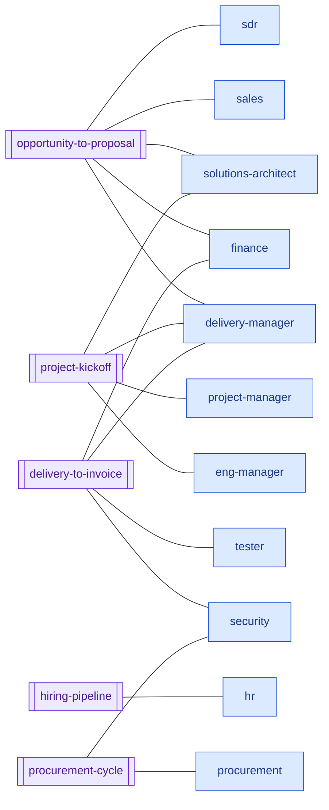
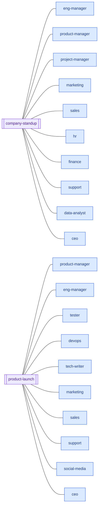

# Agent visualization: workflows · 2026-07-15

Generated with `/visualize-agents`. Agent participation is derived from the persona lines ("As the <role>…") actually present in each `.claude/workflows/*.js` stage prompt — not from memory.

## Diagram — who runs what

## Stage sequences (from each script's `phases`)

| Workflow | Stages → persona |
|---|---|
| `opportunity-to-proposal` | Discovery (sdr/sales) → Scope (solutions-architect) → Estimate (solutions-architect) → Value (finance+sales) → Review (adversarial, unowned) → Proposal (sales + delivery-manager) |
| `project-kickoff` | PO-vs-deal + SOW (delivery-manager + solutions-architect) → resourcing (eng-manager + delivery-manager) → plan & milestones (delivery-manager + project-manager) → risks/kickoff (delivery-manager) |
| `delivery-to-invoice` | Acceptance package (delivery-manager) → QA (tester) → security check (security) → invoice draft (finance) |
| `hiring-pipeline` | Success profile → JD / sourcing / loop / scorecard → fairness check (all hr) |
| `procurement-cycle` | Reclaim check → sourcing/TCO (procurement) → risk check (procurement + security) → PO draft (procurement) |
| `company-standup` | 6 department reports in parallel (eng-manager, product-manager, project-manager, marketing+sales, hr+finance, support+data-analyst) → CEO synthesis |
| `product-launch` | 7 function readiness lenses in parallel (product-manager, eng-manager+tester+devops, tech-writer, marketing, sales, support, social-media) → CEO/launch-owner go/no-go |

## Legend

Purple subroutine = workflow (`.claude/workflows/*.js`) · blue rectangle = AI employee adopting that persona in a stage prompt. Human gates are not re-drawn here — each workflow's outputs stop at the gates mapped in `agent-map-gates.md`.

## Notes — coverage gaps

- **Agents in no lifecycle workflow:** `chief-of-staff` (by design — it routes into workflows), `designer`, `developer`, `code-reviewer`, `account-manager`. The engineering build/review loop and the account-management loop run through direct invocation and skills (`/qbr`, `/ticket-triage`) rather than a workflow — candidates for future workflow coverage.
- **Most load-bearing agent:** `delivery-manager` — persona in 3 of 7 workflows (project-kickoff, delivery-to-invoice, opportunity-to-proposal) and on the critical path of the value chain. `finance`, `sales`, `eng-manager` follow with 3 workflow appearances each (counting standup).
- **Least-connected agent:** `designer` — no workflow, no gate of its own; connected only through direct invocation and handoffs. Candidate for a charter/coverage review.
- `opportunity-to-proposal`'s adversarial deal Review stage runs without a named persona — consider assigning it (e.g. `ceo` or `delivery-manager`) so accountability is explicit.
