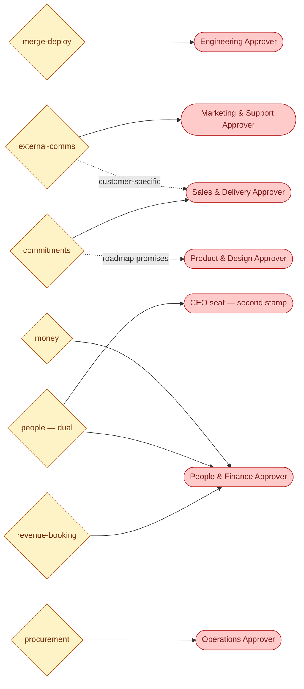
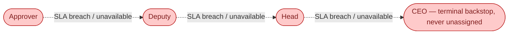

# SOP-R00 — Human Seat-Holders (Approver · Deputy · Head · CEO/Founder)

| | |
|---|---|
| **Applies to** | Every human holding a seat in `company/org/humans/` |
| **Department** | All — seats exist per department (ADR-0003) |
| **Owner** | Founder/CEO |
| **Status** | Active |
| **Version** | 1.2 (2026-07-15) |
| **Loads with** | Foundations SOP-003 (gates), SOP-004 (SLAs), SOP-013 (HITL review) — this SOP is their human-side counterpart |

> The AI workforce runs the company between the gates; you **are** the gates. Your job is not to do the work or redo it — it is to exercise judgment, on time, on the exact action presented, and leave an audit trail. The company's throughput is bounded by your decision latency; its safety is bounded by your rigor.

Every role SOP carries the five mandatory parts (SOP-000 §2a): **Purpose & Scope** (§1) · **Roles & Responsibilities/RACI** (§1a) · **Step-by-Step Instructions** (§2) · **Exceptions & Red Flags** (§4a) · **KPIs & Metrics** (§5a).

## 1. Purpose & scope

**A seat-holder owns:** deciding pending `APR-*`/`QST-*` items routed to their department, within SLA · rejecting with actionable reasons · delegating to another authorized human when appropriate · keeping their availability flag truthful.
**A seat-holder does NOT own:** doing the AI employees' work, editing their artifacts in place (send it back with reasons), approving actions outside their department's gates, or changing routing/seats unilaterally (Head proposes, CEO approves).

**The four seats** (`company/org/departments.md`):
- **Approver** — decides day to day; first assignee of every item in the department.
- **Deputy** — identical authority, engaged when the Approver is unavailable or breaches SLA.
- **Head** — accountable for the department; can decide anything in it; assigns the other seats; proposes seat/routing changes.
- **CEO/Founder** — terminal backstop of every chain; co-stamps `people` gates; the one seat that is never unavailable.

## 1a. Roles & responsibilities (RACI)

| Activity | R | A | C | I |
|---|---|---|---|---|
| Decide pending APR/QST items in the department | Approver | Head | requesting AI role (context) | Deputy |
| Decide when Approver unavailable / SLA breached | Deputy | Head | — | Approver |
| Seat assignments & routing-change proposals | Head | CEO/Founder | department Approver/Deputy | all |
| Dual-stamp `people` gates | people-finance seat + CEO | CEO/Founder | `hr` (prep) | — |
| HITL sample reviews of non-gated output streams (SOP-013 §3a) | Approver (or Head-designated) | Head | `data-analyst` (findings tracking) | stream-owning AI role |
| Terminal backstop of every escalation chain | CEO/Founder | CEO/Founder | — | all |

## 1b. The gate landscape — visual

Every gate you may be asked to decide, and the one escalation chain behind every seat (generated with `/visualize-agents`; full maps in [`docs/org/agent-map-gates.md`](../../org/agent-map-gates.md)):

Escalation only **reassigns** — it never approves, and silence never equals consent (ADR-0004).

## 2. Step-by-step: deciding an item

1. **Read the exact action** on the APR record — the verbatim thing that will happen on approval. If the action is vague ("proceed with the proposal"), that alone is grounds for rejection: send it back for an exact action.
2. **Open the artifact and its record chain** (SOP-002 links). Spot-check, don't re-do: does the artifact match the action, does the action match the record's stage, are the numbers computed, are TBDs honest?
3. **Check you're authorized:** you hold a seat in the item's department (or the CEO seat). `people` items need two distinct stamps — a people-finance seat **and** the CEO. Never stamp both halves as one person unless you genuinely hold both roles (n=1 founder state).
4. **Decide** — approve, reject with reasons, answer (for QST), or delegate to a named authorized human. Use `/approve`, the panel, or chat; **in-chat decisions still get the record stamped** (`decide` is run immediately after). Every decision is attributable: your name, the timestamp, the record.
5. **Approve means exactly that action.** If you'd approve a modified version, reject with the modification — don't approve and hope the modification happens.

## 3. Service levels you owe the company

- Meet the SLA clock (`company/org/routing.md`): P0 2h, P1 1 business day, P2 3 business days. Escalation to your Deputy on breach is machinery, not blame — but chronic breach means the seat needs to move (tell the Head/CEO).
- **Keep availability truthful.** Going offline for a day? Flip your flag in `humans/<you>.md` — items reroute immediately instead of waiting out your SLA.
- **Never rubber-stamp.** An approval you didn't actually evaluate is worse than a late one: it converts the gate into theater. If volume makes real evaluation impossible, that is a top-priority escalation to the CEO (the fix is delegation or process, never lower rigor).
- **Reject well:** a rejection states what's wrong and what "approvable" looks like. "No" without reasons stalls the company.

## 4. Escalation & delegation

- You may delegate any item to any other authorized human in the department (logged as `manual-delegate` hop).
- Judgment beyond your comfort (legal exposure, large money, strategic) → delegate up to the Head or CEO explicitly; don't sit on it until the SLA does it for you.
- If an AI employee's gate request reveals a *systemic* problem (same risky ask recurring, SOP gap, gate being split), decide the item **and** open a task for the fix — the gate is also your sensor.

## 4a. Exceptions & red flags

**Red flags — stop deciding, start investigating:**
- An APR whose artifact contains a fact you know to be wrong, an unpriced number, or another customer's data → reject, and direct the requesting role to freeze that output stream per SOP-013 §4 until root-caused.
- The same risky ask recurring across APRs, or actions that look like a gated act split into non-gated fragments → decide nothing; escalate the pattern to the Head/CEO (possible gate breach).
- Your own approval rate at ~100% with near-zero review time → treat as review theater (SOP-013 §4) and re-calibrate before deciding more items.

**Exception paths:** genuine emergency (P0) does not change what you may approve — only how fast you're asked (SOP-004 cadence). There is no verbal-only approval: chat decisions are stamped into the record immediately. There is no proxy approval: only seat-holders decide, ever.

## 5. Invariants you personally guarantee (ADR-0004)

- Silence never equals consent — nothing you leave pending gets executed.
- Escalation reassigns, never approves — an SLA breach moves the item to your Deputy; it never decides it.
- No AI employee is ever told "assume yes if I don't answer." If you catch one operating that way, stop it and escalate — that's a gate breach.

## 5a. KPIs & metrics

- **Decision latency** vs SLA (P0 2h / P1 1bd / P2 3bd) — % within SLA per seat, monthly; chronic breach = move the seat.
- **Escalation hops per item** — median should be 0 (decided by the first assignee); rising hops mean availability flags or staffing are wrong.
- **Rejection quality** — % of rejections with actionable reasons that led to an approvable resubmission (target ~100%).
- **Review depth signal** — findings rate on HITL samples (SOP-013): sustained zero on complex streams = theater, investigate.
- **Availability-flag accuracy** — items that waited out an SLA on a human who was actually absent — target 0.

## 6. Anti-patterns — never do

- Never approve from the notification alone without opening the artifact.
- Never edit the AI's artifact yourself and then approve your own edit — reject with instructions instead (keeps authorship and accountability clean).
- Never approve a bundle ("all three invoices") when the records are separate — decide each record.
- Never leave your availability flag stale; a skipped human is fine, a silently absent one breaks the SLA math.
- Never punish honest bad news delivered through an escalation — you'll train the workforce to stop surfacing it.

## 7. References

`company/org/` (departments, humans, routing) · ADR-0003, ADR-0004, ADR-0005 · SOP-003, SOP-004, SOP-013 · Plan 001 (Control Panel & approval model) · `/approve` skill.

---
*Changelog: 1.2 — added §1b gate-landscape diagram (`/visualize-agents`). 1.1 — five mandatory parts (RACI, exceptions & red flags, KPIs) per SOP-000 §2a; HITL sampling duties added. 1.0 — initial.*
